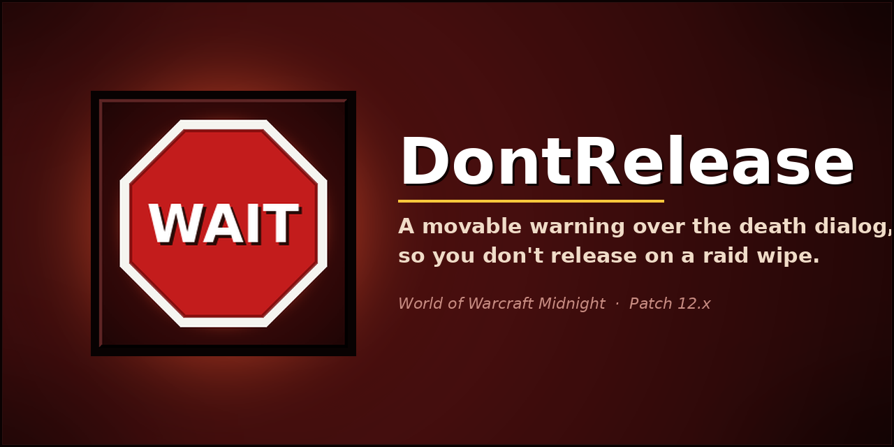

# DontRelease

Blocks accidental release on raid wipes — large warning over the death
dialog, and Enter is disabled while it's up.

## What it does

When you die during a raid wipe and the standard release-spirit dialog
appears, DontRelease shows a large warning over it: **DO NOT RELEASE**,
with "Wait for battle res or raid leader's call." underneath.

While the warning is visible, the **Enter key on the death popup is
disabled** — the addon flips off the popup's default-button keyboard
accelerator so a reflexive Enter (e.g. mashing keys to clear a
focus-stolen chat box) can't release you. Normal behavior restores the
moment the warning is dismissed.

The frame itself is independently movable, scalable, recolorable, and
can be configured to require a deliberate **hold** of Shift / Ctrl / Alt
to dismiss — rather than a single key press — so an accidental modifier
tap during the death animation can't drop the warning by mistake.

A "wipe" is detected by counting dead raid members against a
configurable threshold (default 3) plus an immediate trigger on the
`ENCOUNTER_END` event when an encounter ends in failure. Single deaths
don't pop the warning. While you're dead, the addon also polls once per
second so a wipe that develops ten seconds after your own death still
triggers the warning. The frame auto-hides the instant a battle res
request arrives, and can suppress itself entirely when a self-res is
available (Soulstone, Shaman Reincarnation).

## Features

- **Blocks Enter on the death popup** while the warning is up, so a
  reflexive keystroke or chat focus-loss can't release you. Restored
  automatically as soon as the warning is dismissed.
- **Movable, scalable warning frame** with configurable title text,
  subtitle text, color, and scale (0.5x – 3.0x).
- **Wipe detection** by threshold of dead raid members (configurable 1 –
  30), immediate trigger on `ENCOUNTER_END(success=0)`, and a 1Hz poll
  while dead to catch wipes that cascade slowly (or trash-pull wipes
  with no `ENCOUNTER_END` to backstop).
- **Hold-to-close** option: require Shift / Ctrl / Alt to be held
  continuously for a configurable duration (default 1.5s) instead of a
  single press. A gold progress bar at the bottom of the frame fills as
  the user holds.
- **Smart suppression**: hides on incoming battle res request; hides when
  Soulstone or Shaman Reincarnation is available (each toggleable).
- **10 alert sounds**: 3 Blizzard alarms plus 7 bundled custom .ogg files
  (4 Womp variants + 3 Boop variants). Routable through Master / SFX /
  Music / Ambience / Dialog volume channels.
- **`/dnr` and `/dontrelease` slash commands** for every setting: toggle,
  threshold, scale, sound, reset, status.
- **Addon compartment entry** next to the minimap. Left-click opens
  options, right-click toggles enabled.

## Install

Search "DontRelease" on CurseForge or Wago, or copy the `DontRelease`
folder from a release zip into `World of Warcraft\_retail_\Interface\AddOns\`
and `/reload`.

Type `/dnr` to open the options window.

## Slash commands

| Command | Effect |
| --- | --- |
| `/dnr` | open the options window |
| `/dnr test` | preview the warning for repositioning |
| `/dnr toggle` | enable / disable |
| `/dnr lock` / `unlock` | lock / unlock the frame for dragging |
| `/dnr scale 1.5` | set frame scale (0.5 – 3.0) |
| `/dnr threshold 3` | set the dead-raider threshold (1 – 30) |
| `/dnr sound` | toggle alert sound on / off |
| `/dnr hide` | hide the frame |
| `/dnr status` | print current settings |
| `/dnr reset` | reset position |
| `/dnr reset all` | wipe ALL settings (with reload) |

## Compatibility

- WoW Midnight (Interface 120005, patch 12.x)
- No required dependencies, no embedded libraries, no taint
- No combat-log decisions, no protected APIs

## License

All Rights Reserved. See [`LICENSE`](LICENSE) for full terms — personal
in-game use of the packaged addon is permitted; copying, modifying, or
redistributing the source requires written permission.
